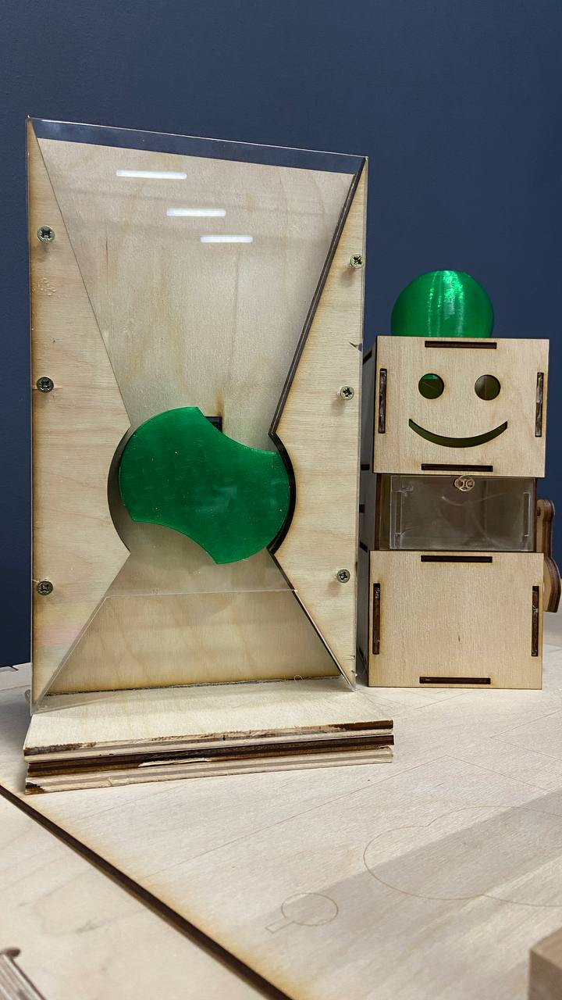
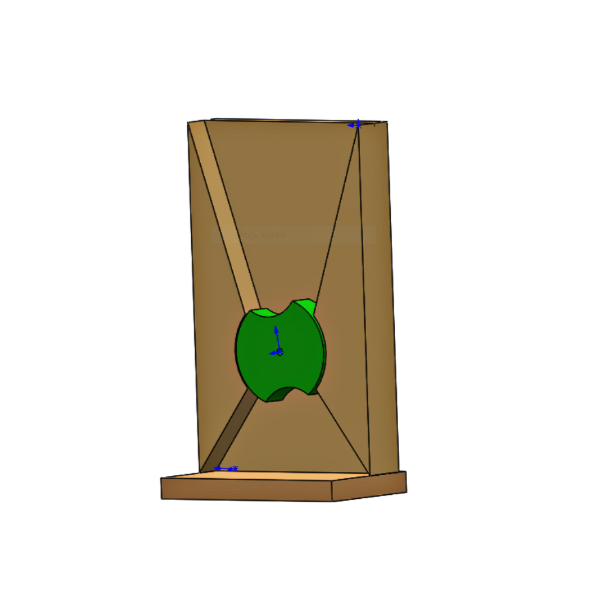
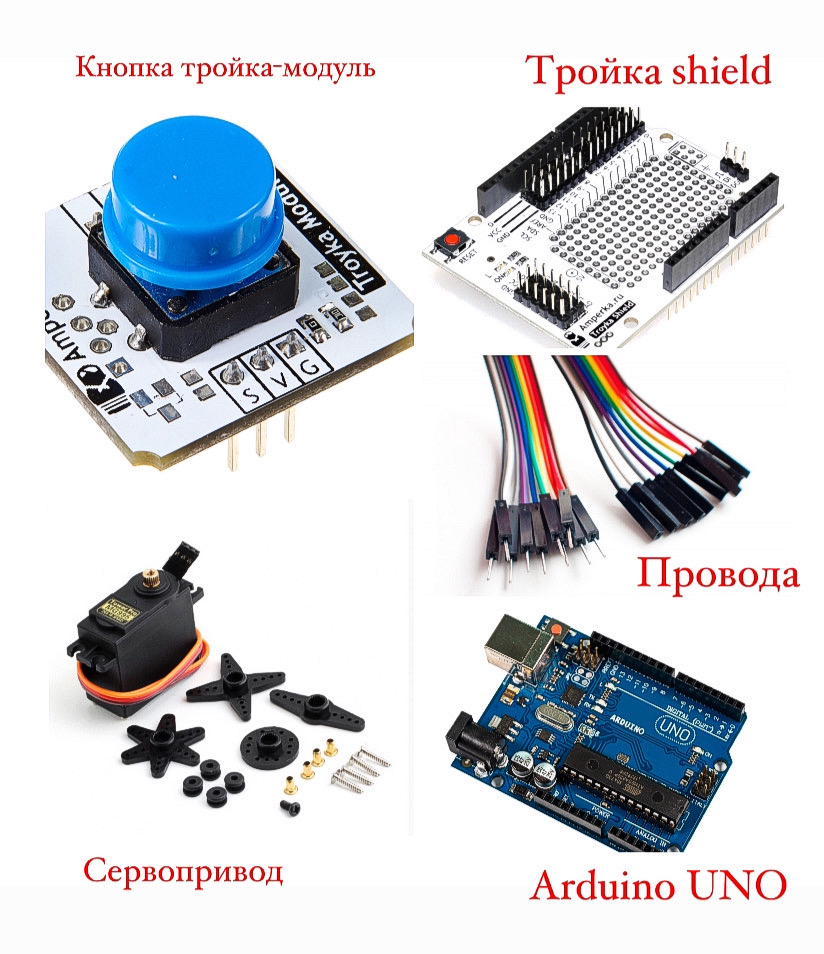
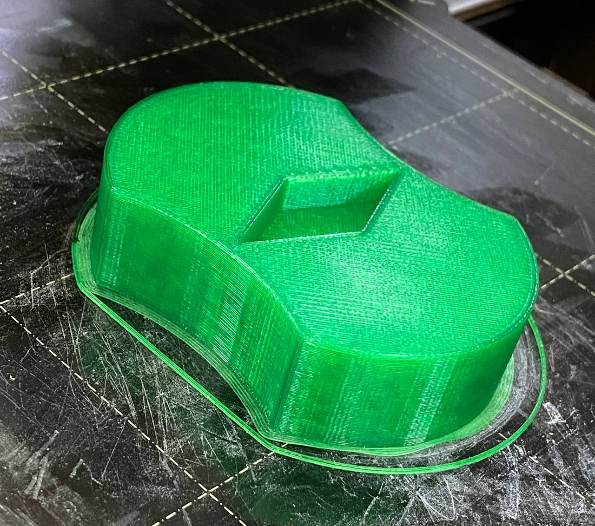
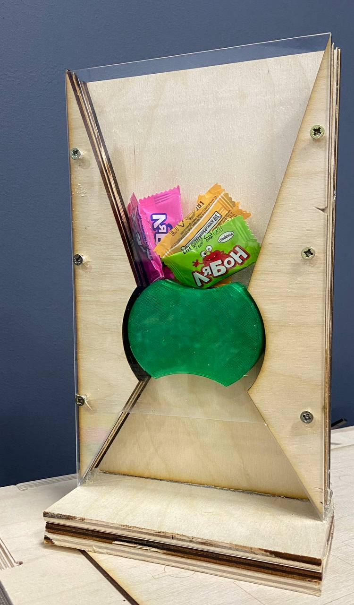

# Arduino PET

Первоначальная концепция [кормушки](https://docs.google.com/document/d/1eeYgj-7QOGEoIyR_qHg_aKij6az8DH2gtLKJCn2PNqM/edit).

*Концепцию пришлось изменить из-за возникшим проблемы в конструкции*



Рис.1- Новый измененный вид 

## 3D-моделирование 



Рис.2-3D-модель кормушки в SolidWorks


**Оборудование :** 3D-принтер Pruca i3 MK3,Лазерный станок GCC Spirit GLS100

**Инструменты:** Шуруповерт,штангенциркуль,шлифмашинка

**Материалы:** PETG(полиэтилентерефталат),6мм фанерный лист,саморезы 3.5*16 мм,3мм акрил.

### ЭЛЕКТРОНИКА 





Рис.3-Элементы схемы 


* Кнопка тройкамодуль

* Troyka shield

* Сервопривод с удержанием угла

* Провода

* Arduino UNO

#### Изготовление и сборка 



Рис.4-Деталь кормушки 



Рис.5-Вид изготовленной кормушки 

##### Код 

```C++
#include <Servo.h>


const int buttonPin = 8; // пин, к которому подключена кнопка
int buttonState = 0; // переменная для хранения состояния кнопки
int lastButtonState = 0; // переменная для хранения предыдущего состояния кнопки
int buttonPressCount = 0; // счетчик нажатий на кнопку


Servo myServo; // создание объекта для управления сервоприводом
int pos = 0; // текущая позиция сервопривода


void setup() {
 pinMode(buttonPin, INPUT); // устанавливаем пин кнопки как вход
 myServo.attach(10); // подключаем сервопривод к пину 9
}


void loop() {
 buttonState = digitalRead(buttonPin); // считываем состояние кнопки


 if (buttonState != lastButtonState) {
   if (buttonState == HIGH) {
     buttonPressCount++; // увеличиваем счетчик нажатий при нажатии на кнопку
     if (buttonPressCount % 2 == 1) {
       // Если количество нажатий нечетное, поворачиваем сервопривод на 180 градусов
       pos += 180;
     } else {
       // Если количество нажатий четное, поворачиваем сервопривод обратно на 180 градусов
       pos -= 180;
     }
     myServo.write(pos); // устанавливаем позицию сервопривода
   }
 }


 lastButtonState = buttonState; // сохраняем текущее состояние кнопки
}
```

**Рабочий процесс кормушки**


https://github.com/madinakhakimova/Arduino-PET/assets/144451345/b6f8a3d4-8b1a-4a4c-bc0e-3c86eb585e7f


